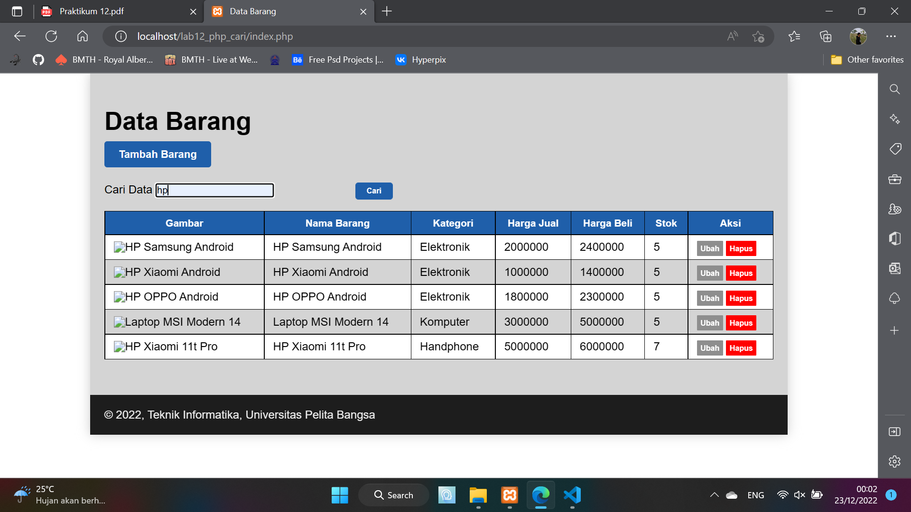

# Lab12Web
## Ananda Fachri Reynaldi
## 312110248
## TI.21.B1
<br>
<b>XAMPP</b>

Buka XAMPP Control Lalu Klik `Start` untuk menjalankan MySQL Server. Pastikan web server Apache dan MySQL Server sudah dijalankan.
<br>

<b> Membuat Pencarian Data</b>

Pada data awal, query untuk menampilkan semua data adalah : 
```
$sql = “SELECT * FROM data_barang”;
```
Nah untuk menambahkan pencarian, maka query tersebut harus ditambahkan klausa WHERE sebagai 
filter, sehingga menjadi:
```
$sql = “SELECT * FROM data_barang WHERE nama = ‘{$var_nama}’”;
```
Atau dapat juga menggunakan LIKE seperti berikut:
```
$sql = “SELECT * FROM data_barang WHERE nama LIKE ‘{$var_nama}%’”;
```

Mengubah Query dan tambahkan filter pencarian pada Query tersebut
<br>

Membuat Form Pencarian
<br>

Setelah itu uji coba gunakan URL :
```
http://localhost/lab12_php_cari/index.php
```
<br>

Mencoba untuk mencari barang dengan keyword `HP`<br>
<br>

Hasilnya :<br>
<br>